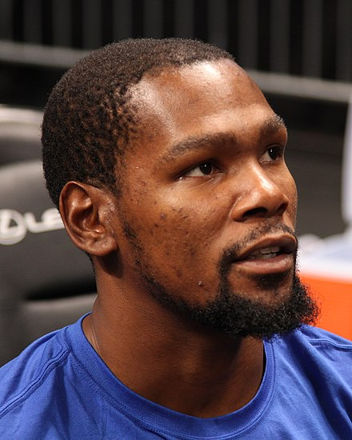
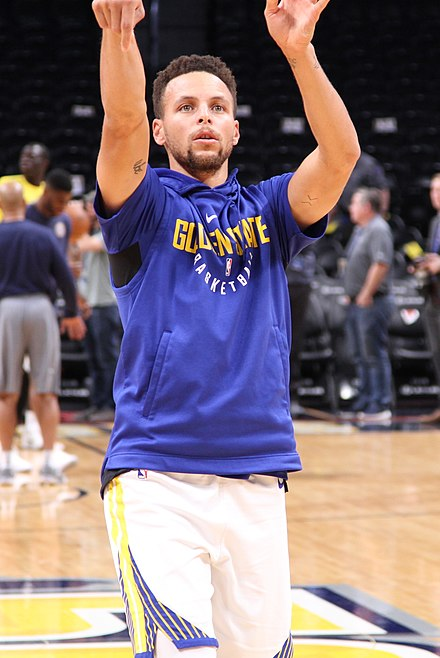
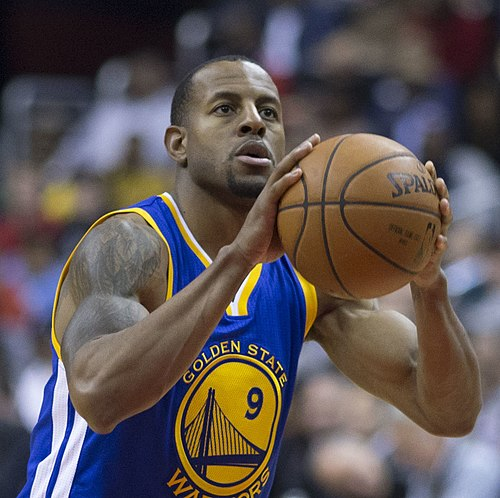
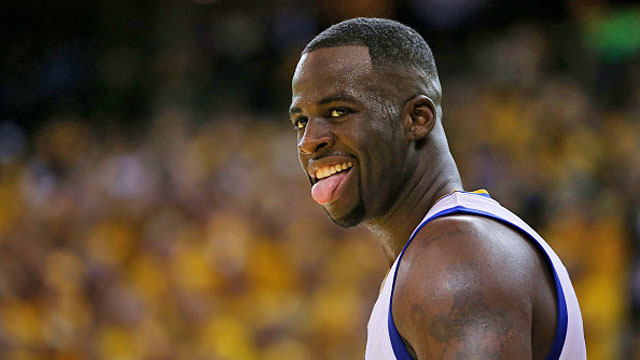
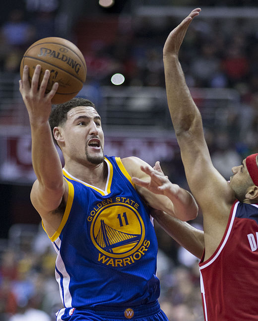
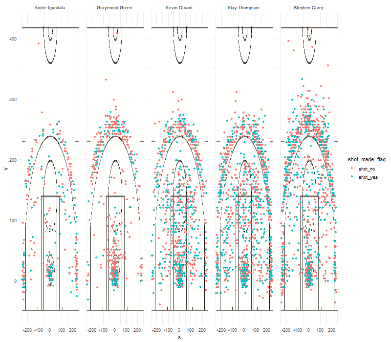

# Introduction
This report is aim to introduce 5 great players of NBA who belong to Golden State Warriors. After reading this report, the reader would be very familiar with them and their performances. The reader would also develop a better understanding of Golden State Warrior as a whole. 

#Organization
We plan to introduce each player seperately first, then group our data together and compare their performance

##Player One: Kevin Durant Introduction
```{r out.width='80%', echo= FALSE, fig.align='center'}

```
Kevin Wayne Durant (born September 29, 1988) is an American professional basketball player for the Golden State Warriors of the National Basketball Association (NBA). He played one season of college basketball for the University of Texas, and was selected as the second overall pick by the Seattle SuperSonics in the 2007 NBA draft. He played nine seasons in Oklahoma City before signing with Golden State in 2016, winning back-to-back championships in 2017 and 2018.

Durant was a heavily recruited high school prospect who was widely regarded as the second-best player in his class. In college, he won numerous year-end awards and became the first freshman to be named Naismith College Player of the Year. As a professional, he has won two NBA championships, an NBA Most Valuable Player Award, two Finals MVP Awards, two NBA All-Star Game Most Valuable Player Awards, four NBA scoring titles, the NBA Rookie of the Year Award, and two Olympic gold medals. Durant has also been selected to eight All-NBA teams and ten NBA All-Star teams.

Off the court, Durant is one of the highest-earning basketball players in the world, due in part to endorsement deals with companies such as Foot Locker and Nike. He has developed a reputation for philanthropy and regularly leads the league in All-Star votes and jersey sales. In recent years, he has contributed to The Players' Tribune as both a photographer and writer. In 2012, he ventured into acting, appearing in the film Thunderstruck.


##Player TWO: Stephen Curry Introduction
```{r out.width='80%', echo= FALSE, fig.align='center'}

```
Wardell Stephen Curry II (/'st??f??n/ STEF-??n; born March 14, 1988) is an American professional basketball player for the Golden State Warriors of the National Basketball Association (NBA). A six-time NBA All-Star, he has been named the NBA Most Valuable Player (MVP) twice and won three NBA championships with the Warriors. Many players and analysts have called him the greatest shooter in NBA history.[1] He is credited with revolutionizing the game of basketball by inspiring teams to regularly employ the three-point shot as part of their winning strategy.

In 2014-15, Curry won his first MVP award and led the Warriors to their first championship since 1975. The following season, he became the first player in NBA history to be elected MVP by a unanimous vote and to lead the league in scoring while shooting above 50-40-90. That same year, the Warriors broke the record for the most wins in an NBA season en route to reaching the 2016 NBA Finals, which they lost to the Cleveland Cavaliers. Curry helped the Warriors return to the NBA Finals in 2017 and 2018, where they won back-to-back titles.

Curry is the son of former NBA player Dell Curry and older brother of current NBA player Seth Curry. He played college basketball for Davidson. There, he was twice named Southern Conference Player of the Year and set the all-time scoring record for both Davidson and the Southern Conference. During his sophomore year, he also set the single-season NCAA record for three-pointers made.

During the 2012-13 season, Curry set the NBA record for three-pointers made in a regular season with 272. He surpassed that record in 2015 with 286, and again in 2016 with 402. Curry is currently third in all-time made three-pointers in NBA history. The 2012-13 season saw Curry and teammate Klay Thompson earn the nickname of the Splash Brothers, with the pair going on to set the NBA record for combined three-pointers in a season with 484 in 2013-14, a record they broke the following season (525) and again in the 2015-16 season (678).


##Player THREE: Andre Iguodala
```{r out.width='80%', echo= FALSE, fig.align='center'}

```

Andre Tyler Iguodala ( born January 28, 1984) is an American professional basketball player for the Golden State Warriors of the National Basketball Association (NBA). The swingman was an NBA All-Star in 2012 and has been named to the NBA All-Defensive Team twice. Iguodala won an NBA championship with the Warriors in 2015, when he was named the NBA Finals Most Valuable Player. Iguodala helped the Warriors win two more championships in 2017 and 2018. He was also a member of the United States national team at the 2010 FIBA World Championship and 2012 Summer Olympics, winning the gold medal both times.

Iguodala went to Lanphier High School in Springfield, Illinois, before attending the University of Arizona. After completing two years, he declared for the 2004 NBA draft, where he was drafted as the ninth overall pick by the Philadelphia 76ers. Iguodala played for Philadelphia until the summer of 2012, when he joined the Denver Nuggets in a four-team trade. He was acquired by Golden State in 2013. In 2014-15, he became a reserve for the first time in his career, but captured the Finals MVP after returning to the starting lineup in the middle of the finals series.

##Player FOUR: Draymond Green
```{r out.width='80%', echo= FALSE, fig.align='center'}

```
Draymond Jamal Green Sr. (born March 4, 1990) is an American professional basketball player for the Golden State Warriors of the National Basketball Association (NBA). Green, who plays primarily at the power forward position, is a three-time NBA champion and a three-time NBA All-Star. In 2017, he won the NBA Defensive Player of the Year.

Green grew up in Saginaw, Michigan, and played college basketball for Michigan State, where he helped the Spartans earn two Final Four appearances and a Big Ten Tournament championship in 2012. Throughout his four-year college career, Green earned conference and national honors, including Big Ten Conference Sixth Man of the Year as a sophomore, and consensus All-American and NABC National Player of the Year honors as a senior. He went on to be drafted 35th overall in the 2012 NBA draft by the Golden State Warriors, and later played a key role on the Warriors' 2015, 2017 and 2018 championship teams.

Green, who often plays significant minutes for the Warriors as an undersized center in their Death Lineup, has been cited as one of the leaders in an emerging trend in the NBA of versatile frontcourt players capable of playing and defending multiple positions, making plays for teammates and spacing the floor.

##Player FIVE: Klay Thompson
```{r out.width='80%', echo= FALSE, fig.align='center'}

```
Klay Alexander Thompson (born February 8, 1990)[1] is an American professional basketball player for the Golden State Warriors of the National Basketball Association (NBA). He is credited as one of the greatest shooters in NBA history. He is a five-time NBA All-Star, a two-time All-NBA Third Team honoree, and a three-time NBA champion.

Thompson is the son of former NBA player Mychal Thompson. He played college basketball for three seasons with the Washington State Cougars, where he was a two-time first-team all-conference selection in the Pac-10. He was selected in the first round of the 2011 NBA draft by Golden State with the 11th overall pick.

In 2014, Thompson and teammate Stephen Curry set a then NBA record with 484 combined three-pointers in a season,[4] earning the pair the nickname the "Splash Brothers".In 2015, Thompson helped lead the Warriors to their first NBA Championship since 1975, and was a key contributor in the Warriors' 2017 and 2018 titles.

## Analysis
```{r out.width='80%', echo= FALSE, fig.align='center'}

```


* We see that Iguodala in general didn't have a lot of shots comparing with others. This may be due to his own position: shooting guard while others for example, curry is point guard. By checking the distribution of shots, we also see many interesting facts. For example, curry has shots in each range 0-100,100-200, and over 200, while Green for example, doesn't have a lot of shots in 100-200. If we want to dig futher, we should count the shots in those three ranges and compute the frequncies of each player to see their 'preference' and whether or not they fit their positions.


* now we check the **effective shooting percentage** by showing three tables: Effective Shooting % by Player, 2PT Effective Shooting % by Player, and 3PT Effective Shooting % by Player
* We first show Effective Shooting % by Player we see that actually Iguodala has the best perc_made! However, this doesn't really mean that he is better than curry since he just made 371 shots while curry made 1250 shots. It is possible that Iguodala would only shot when he finds a situation that he is very confident that he would make it or otherwise he will pass to his teeamattes.
```{r}
library(dplyr)
df <- read.csv("../data/shots-data.csv", stringsAsFactors = FALSE)
es = summarize(group_by(df,name),total = n(),made = sum(shot_made_flag =="shot_yes"), perc_made = made/total)
show(es)
```
* We then show Effective 2 points Shooting % by Player We see that Iguodala still leads but curry perform better on 2 points. Durant has an astondinly 60% made rate!
```{r}
library(dplyr)
df <-  read.csv("../data/shots-data.csv", stringsAsFactors = FALSE)
df2 = filter(df,shot_type == '2PT Field Goal')
es2 = summarize(group_by(df2,name),total = n(),made = sum(shot_made_flag =="shot_yes"), perc_made = made/total)
show(es2)
```
* We then show Effective 3 points Shooting % by Player We see that thompson now performs better and we see that it's much better to make 3 points than 2 points. Iguodala has no talent in making 3 points!
```{r}
library(dplyr)
df <- read.csv("../data/shots-data.csv", stringsAsFactors = FALSE)
df3 = filter(df,shot_type == '3PT Field Goal')
es3 = summarize(group_by(df3,name),total = n(),made = sum(shot_made_flag =="shot_yes"), perc_made = made/total)
show(es3)
```

#Sumamry

We did an extensive research on 5 players' performances. We see that Durant and Curry are very hard working they did a lot of shots during games and they are the pillars of GSW. Also we see that its much harder to do 3 points than 2 points and your rates will kinda be averaged by large shots(Curry example). It's similar to playing card games-- if you have over 10000 games you will find that your win rate would be only around 50% and it's really hard to achieve 60%. From that perspective, Durant is a master in 2 points shot. 


